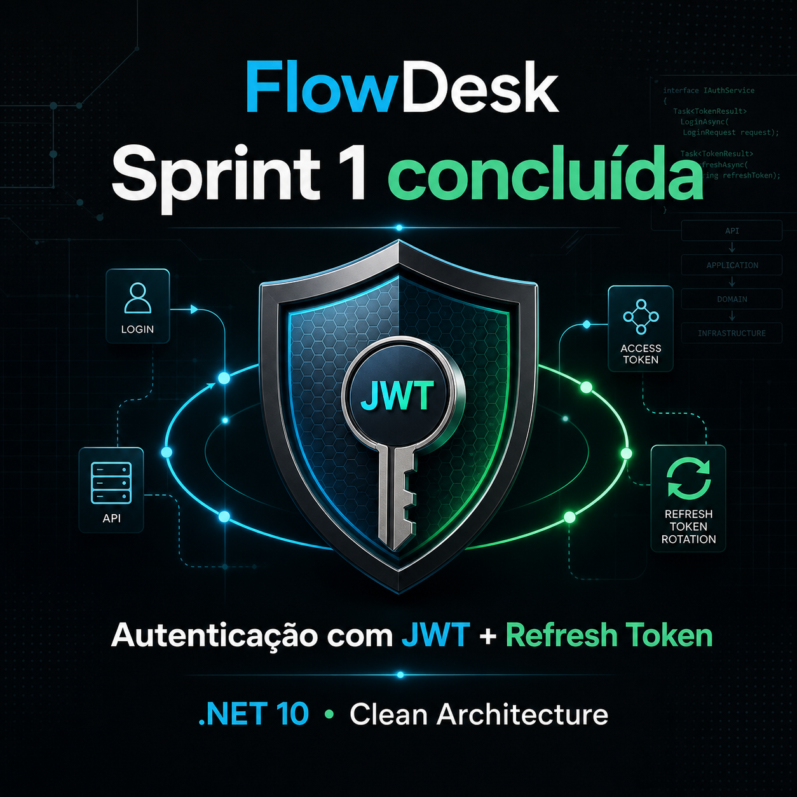
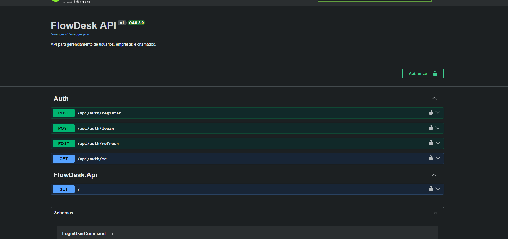
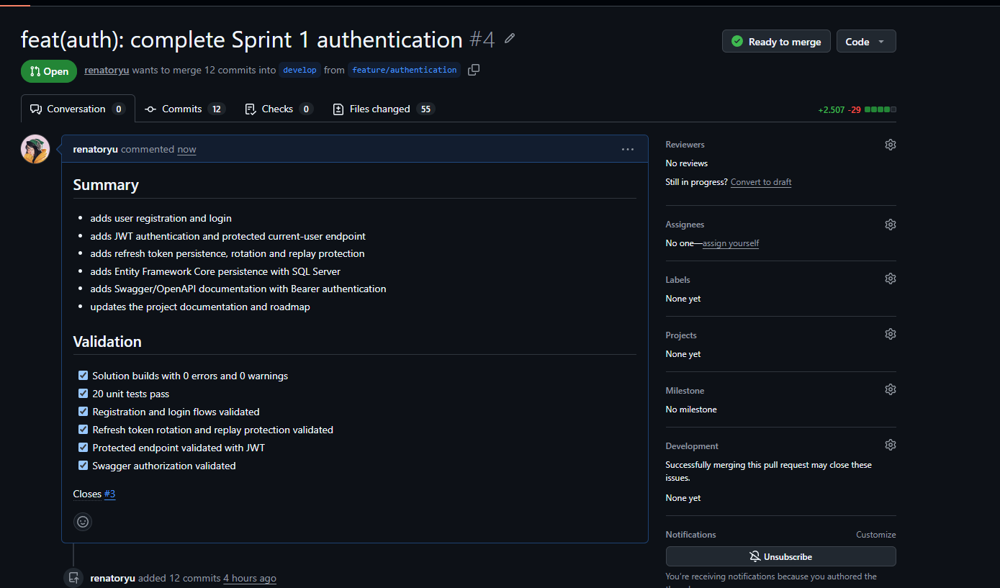
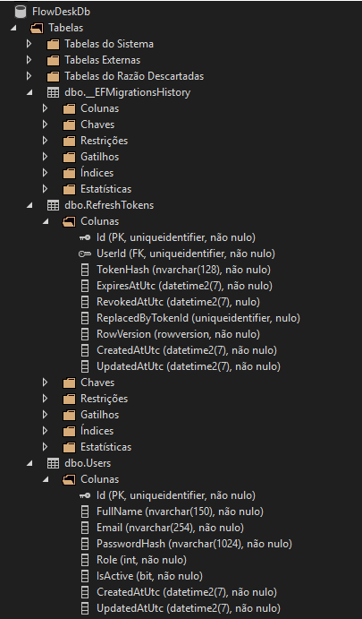

# Sprint 1 — Autenticação de usuários

## Visão geral

A Sprint 1 implementou a base de autenticação do FlowDesk, cobrindo cadastro, login, emissão de JWT, renovação de sessão com refresh token e documentação interativa da API.

A implementação segue uma arquitetura inspirada na Clean Architecture, mantendo regras de negócio, casos de uso, persistência e entrada HTTP em camadas separadas.

## Funcionalidades entregues

- Cadastro de usuários.
- Validação dos dados de entrada.
- Armazenamento seguro de senhas com hash.
- Login com e-mail e senha.
- Emissão de access token JWT.
- Persistência segura de refresh tokens.
- Rotação do refresh token a cada renovação.
- Rejeição de tokens expirados ou já utilizados.
- Endpoint protegido para consultar o usuário autenticado.
- Respostas de erro padronizadas com `ProblemDetails`.
- Documentação Swagger/OpenAPI com autenticação Bearer.

## Organização por camada

| Camada | Responsabilidade |
|---|---|
| `FlowDesk.Domain` | Entidades `User` e `RefreshToken`, regras e invariantes de negócio |
| `FlowDesk.Application` | Casos de uso de cadastro, login e renovação da sessão |
| `FlowDesk.Infrastructure` | Entity Framework Core, SQL Server, JWT, hashing e repositórios |
| `FlowDesk.Api` | Endpoints HTTP, autenticação, tratamento de erros e Swagger |
| `FlowDesk.UnitTests` | Testes automatizados das entidades de domínio |

## Fluxos implementados

### Cadastro

1. A API recebe nome, e-mail e senha.
2. O comando é validado com FluentValidation.
3. O e-mail é normalizado e verificado no banco.
4. A senha é transformada em hash.
5. O usuário é persistido com o perfil `Customer`.

### Login

1. O usuário informa e-mail e senha.
2. A aplicação localiza a conta e verifica o hash da senha.
3. Um access token JWT de curta duração é emitido.
4. Um refresh token criptograficamente aleatório é criado.
5. Apenas o hash do refresh token é armazenado no banco.

### Renovação da sessão

1. O cliente envia o refresh token atual.
2. A aplicação calcula seu hash e procura o registro correspondente.
3. O token é validado quanto à expiração e revogação.
4. O token utilizado é revogado.
5. Um novo access token e um novo refresh token são emitidos.
6. `RowVersion` protege a rotação contra atualizações concorrentes.

## Endpoints

| Método | Endpoint | Autenticação | Finalidade |
|---|---|---|---|
| `POST` | `/api/auth/register` | Não | Cadastrar um usuário |
| `POST` | `/api/auth/login` | Não | Iniciar uma sessão |
| `POST` | `/api/auth/refresh` | Refresh token | Renovar e rotacionar os tokens |
| `GET` | `/api/auth/me` | Bearer JWT | Consultar o usuário autenticado |

## Decisões de segurança

- As senhas nunca são armazenadas em texto puro.
- O hashing utiliza o `PasswordHasher` do ASP.NET Core.
- A chave de assinatura JWT fica em User Secrets e não é versionada.
- O access token possui duração curta.
- O refresh token é gerado com 64 bytes aleatórios.
- Somente o SHA-256 do refresh token é persistido.
- Tokens utilizados durante uma rotação são revogados.
- JWTs validam assinatura, emissor, audiência e expiração.
- Mensagens de login inválido não revelam se uma conta existe.

## Persistência

O Entity Framework Core gerencia as tabelas:

- `Users`
- `RefreshTokens`
- `__EFMigrationsHistory`

Foram criadas as migrations:

- `InitialCreate`
- `AddRefreshTokens`

O ambiente de desenvolvimento utiliza SQL Server Express LocalDB.

## Validação realizada

- Solução compilada com 0 erros e 0 avisos.
- 20 testes unitários aprovados.
- Cadastro válido e inválido verificados.
- E-mail duplicado retorna conflito.
- Login válido e inválido verificados.
- Endpoint protegido retorna `401` sem JWT.
- Endpoint protegido retorna `200` com JWT válido.
- Rotação do refresh token validada.
- Reutilização do token anterior retorna `401`.
- Autenticação Bearer validada pelo Swagger.

## Evidências

### Documentação da API

### Pull Request da Sprint 1

### Estrutura do banco de dados

## Rastreabilidade

- [Issue #3 — Sprint 1: autenticação](https://github.com/renatoryu/FlowDesk/issues/3)
- [Pull Request #4 — autenticação para develop](https://github.com/renatoryu/FlowDesk/pull/4)
- [Pull Request #5 — release da Sprint 1](https://github.com/renatoryu/FlowDesk/pull/5)

## Próximos aprimoramentos

- Criar testes de aplicação e integração.
- Configurar integração contínua para build e testes.
- Adicionar limitação de tentativas nos endpoints de autenticação.
- Implementar revogação de toda a família de refresh tokens após reutilização.
- Configurar CORS junto à integração do front-end.
- Iniciar a Sprint 2, responsável pelo gerenciamento de empresas.
