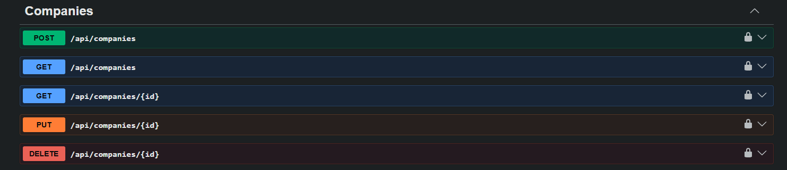
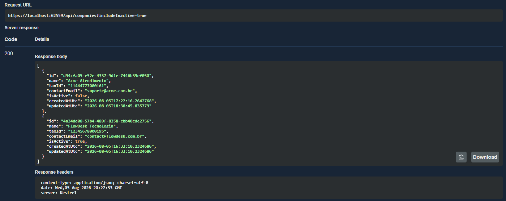
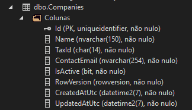
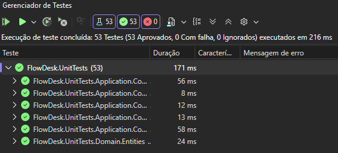
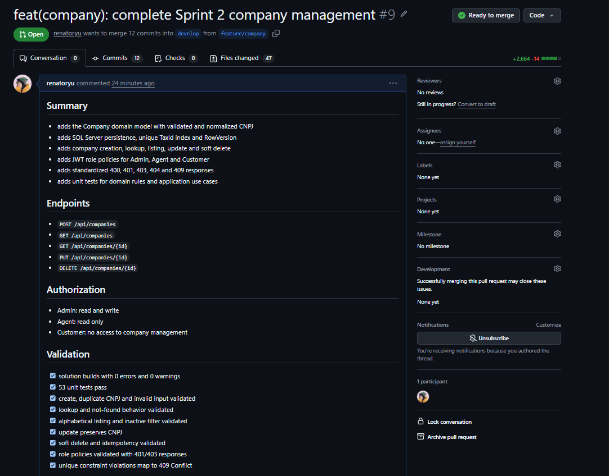

# Sprint 2 — Gerenciamento de empresas

## Visão geral

A Sprint 2 implementou o gerenciamento completo de empresas no FlowDesk, cobrindo criação, consulta, listagem, atualização e desativação lógica.

A implementação mantém as responsabilidades separadas entre domínio, casos de uso, persistência e API, seguindo a arquitetura adotada pelo projeto.

## Funcionalidades entregues

- Modelagem da entidade `Company`.
- Cadastro de empresas.
- Validação e normalização de CNPJ.
- Consulta por identificador.
- Listagem ordenada alfabeticamente.
- Filtro para incluir empresas inativas.
- Atualização de nome e e-mail.
- Desativação lógica e idempotente.
- Autorização baseada nos perfis `Admin`, `Agent` e `Customer`.
- Respostas de erro padronizadas com `ProblemDetails`.
- Documentação dos endpoints no Swagger/OpenAPI.

## Regras de negócio

- A empresa deve possuir nome, CNPJ e e-mail de contato.
- O nome possui limite de 150 caracteres.
- O CNPJ deve possuir 14 dígitos e verificadores válidos.
- Somente dígitos ASCII são aceitos no CNPJ.
- Pontuação do CNPJ é removida antes da persistência.
- O CNPJ é único e não pode ser alterado.
- O e-mail possui limite de 254 caracteres.
- O e-mail é validado por uma regra compartilhada entre Application e Domain.
- O e-mail é normalizado para letras minúsculas.
- Toda empresa é criada como ativa.
- A exclusão é lógica: o registro permanece no banco.
- Repetir a desativação não gera nova alteração.
- Empresas inativas permanecem consultáveis por identificador.
- Empresas inativas aparecem na listagem somente com `includeInactive=true`.
- O CNPJ de uma empresa inativa continua reservado para preservar o histórico.
- `CreatedAtUtc` e `UpdatedAtUtc` registram o ciclo de vida da entidade.
- `RowVersion` oferece proteção contra alterações concorrentes.

## Organização por camada

| Camada | Responsabilidade |
|---|---|
| `FlowDesk.Domain` | Entidade `Company`, validações, normalização e regras de ativação |
| `FlowDesk.Application` | Casos de uso de criação, consulta, listagem, atualização e desativação |
| `FlowDesk.Infrastructure` | Entity Framework Core, SQL Server, configuração e repositório |
| `FlowDesk.Api` | Endpoints HTTP, políticas de autorização e respostas |
| `FlowDesk.UnitTests` | Testes das regras de domínio e dos casos de uso |

## Fluxos implementados

### Cadastro

1. A API recebe nome, CNPJ e e-mail.
2. O comando é validado com FluentValidation.
3. A entidade valida e normaliza os dados.
4. O sistema verifica se o CNPJ já está cadastrado.
5. A empresa é persistida como ativa.
6. A API retorna `201 Created` e o endereço do novo recurso.

### Consulta e listagem

1. A consulta por ID procura a empresa no repositório.
2. Um ID inexistente retorna `404 Not Found`.
3. A listagem padrão retorna somente empresas ativas.
4. `includeInactive=true` inclui empresas desativadas.
5. Os resultados são ordenados alfabeticamente pelo nome.

### Atualização

1. O ID é recebido pela rota.
2. O corpo contém somente nome e e-mail.
3. O CNPJ não faz parte do contrato de atualização.
4. Os novos dados são validados e normalizados.
5. O registro rastreado pelo Entity Framework é atualizado.
6. A API retorna `200 OK`.

### Desativação

1. A API localiza a empresa pelo ID.
2. A entidade altera `IsActive` para `false`.
3. O registro permanece no banco de dados.
4. A API retorna `204 No Content`.
5. Uma nova desativação também retorna `204`, sem gravar novamente.

## Endpoints

| Método | Endpoint | Acesso | Finalidade |
|---|---|---|---|
| `POST` | `/api/companies` | Admin | Cadastrar empresa |
| `GET` | `/api/companies` | Admin ou Agent | Listar empresas |
| `GET` | `/api/companies/{id}` | Admin ou Agent | Consultar empresa por identificador |
| `PUT` | `/api/companies/{id}` | Admin | Atualizar nome e e-mail |
| `DELETE` | `/api/companies/{id}` | Admin | Desativar logicamente |

## Autorização

| Perfil | Leitura | Escrita |
|---|---:|---:|
| `Customer` | Não | Não |
| `Agent` | Sim | Não |
| `Admin` | Sim | Sim |

As políticas aplicadas pela API são:

- `CompanyRead`: permite `Admin` e `Agent`.
- `CompanyWrite`: permite somente `Admin`.

Uma requisição sem JWT retorna `401 Unauthorized`. Um usuário autenticado sem o perfil necessário recebe `403 Forbidden`.

## Persistência

A migration `AddCompanies` criou a tabela `Companies` com:

- `Id`
- `Name`
- `TaxId`
- `ContactEmail`
- `IsActive`
- `CreatedAtUtc`
- `UpdatedAtUtc`
- `RowVersion`

O índice único `IX_Companies_TaxId` impede CNPJs duplicados.

Violações de unicidade do SQL Server são traduzidas para `409 Conflict`, inclusive em uma possível concorrência entre cadastros simultâneos.

O ambiente de desenvolvimento utiliza SQL Server Express LocalDB.

## Respostas HTTP

| Status | Situação |
|---:|---|
| `200 OK` | Consulta, listagem ou atualização concluída |
| `201 Created` | Empresa cadastrada |
| `204 No Content` | Empresa desativada |
| `400 Bad Request` | Dados de entrada inválidos |
| `401 Unauthorized` | JWT ausente ou inválido |
| `403 Forbidden` | Perfil sem permissão |
| `404 Not Found` | Empresa inexistente |
| `409 Conflict` | CNPJ duplicado ou conflito de concorrência |
| `500 Internal Server Error` | Falha inesperada |

## Validação realizada

- Solução compilada com 0 erros e 0 avisos.
- Formatação validada com `dotnet format`.
- 53 testes unitários aprovados.
- CNPJ válido, inválido, repetido e Unicode verificados.
- Normalização do CNPJ para 14 dígitos verificada.
- E-mail inválido rejeitado antes de chegar ao domínio.
- Cadastro duplicado retorna `409 Conflict`.
- Consulta existente retorna `200 OK`.
- Consulta inexistente retorna `404 Not Found`.
- Listagem alfabética validada.
- Filtro de empresas inativas validado.
- Atualização mantém o CNPJ original.
- Desativação lógica validada.
- Repetição do `DELETE` retorna `204 No Content`.
- `Customer` recebe `403` nos endpoints de empresas.
- `Agent` possui somente acesso de leitura.
- `Admin` possui acesso de leitura e escrita.

## Evidências

### Swagger/OpenAPI

### Listagem com empresa inativa

### Estrutura do banco de dados

### Testes automatizados

### Pull Request

## Rastreabilidade

- [Issue #8 — Sprint 2: gerenciamento de empresas](https://github.com/renatoryu/FlowDesk/issues/8)
- [Pull Request #9 — gerenciamento de empresas para develop](https://github.com/renatoryu/FlowDesk/pull/9)

## Próximos aprimoramentos

- Adicionar testes de integração da API e do Entity Framework Core.
- Automatizar build e testes com integração contínua.
- Adicionar paginação à listagem.
- Definir o fluxo de reativação de empresas.
- Evoluir a concorrência HTTP com ETag e `If-Match`.
- Iniciar a Sprint 3, responsável pelo gerenciamento de chamados.